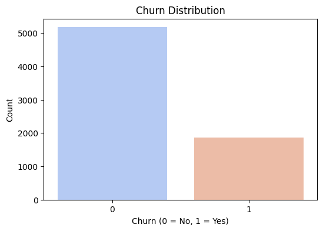
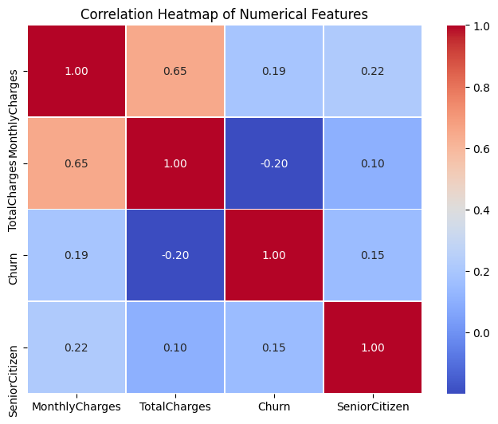
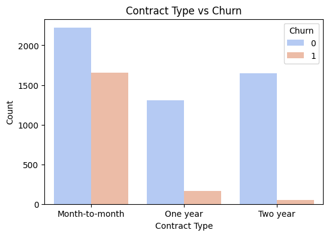

# Telecom Customer Churn Prediction

## Table of Contents
- [Overview](#overview)
- [Business Problem](#business-problem)
- [Dataset](#dataset)
- [Exploratory Data Analysis (EDA)](#exploratory-data-analysis-eda)
- [Feature Engineering](#feature-engineering)
- [Modeling Approach](#modeling-approach)
- [Results & Model Performance](#results--model-performance)
- [Key Insights & Business Impact](#key-insights--business-impact)
- [Next Steps & Potential Improvements](#next-steps--potential-improvements)
- [How to Use](#how-to-use)
- [Connect With Me](#connect-with-me)

---

## Overview
This project focuses on predicting **customer churn** for a telecom operator using **machine learning models**. By identifying high-risk customers, the company can proactively **reduce churn rates** by offering personalized promotions and retention strategies.

## Business Problem
Telecom company **Interconnect** provides landline and internet services with flexible plans and additional features like online security and cloud storage. They want to:
- Predict **which customers are likely to churn** (i.e., terminate their contract).
- Identify **key factors driving churn** (e.g., contract length, payment method).
- Enable **targeted retention efforts** to minimize revenue loss.

## Dataset
The dataset consists of four CSV files:
- **contract.csv** → Contract details (plan type, payment method, tenure).
- **personal.csv** → Customer demographics (gender, senior status).
- **internet.csv** → Internet service details (DSL vs. Fiber, security add-ons).
- **phone.csv** → Phone service details (number of lines, call features).

The target variable is **Churn**, defined as customers who **did not renew their contract**.

---

## Exploratory Data Analysis (EDA)
### **Key Findings**
- **Churn rate:** ~27% of customers left the service.
- **Contract type impact:** **Month-to-month contracts** had the highest churn rates.
- **Payment method correlation:** Customers on **automatic payments were less likely to churn**.
- **Service usage patterns:** **Fiber optic users had higher churn rates** than DSL users.

#### **Churn Distribution**

#### **Correlation Heatmap**

#### **Contract Type vs. Churn**

---

## Feature Engineering
To improve model performance, we:
- Converted categorical variables using **one-hot encoding**.
- Engineered new features, such as **tenure bins** and **contract length categories**.
- Scaled numerical features using **StandardScaler** for better model convergence.

---

## Modeling Approach
We trained and compared the following models:
- **Logistic Regression** (Baseline)
- **Random Forest Classifier**
- **Gradient Boosting Classifier (XGBoost)**

Model evaluation was based on:
- **AUC-ROC Score** (Primary metric)
- **Accuracy**
- **Precision-Recall Curve Analysis**

---

## Results & Model Performance
| Model                  | AUC-ROC Score | Accuracy |
|------------------------|--------------|----------|
| Logistic Regression    | 0.78         | 0.80     |
| Random Forest         | 0.85         | 0.83     |
| Gradient Boosting (XGB) | **0.87**  | **0.85** |

 **Gradient Boosting achieved the best performance** with an **AUC-ROC of 0.87**, exceeding the company’s target threshold.

---

## Key Insights & Business Impact
- **Short-term contracts are high-risk:** Customers on **month-to-month** plans are much more likely to churn.
- **Auto-payment users are loyal:** Customers who use **automatic billing churn less frequently**.
- **Service type matters:** Fiber optic users are more likely to churn, suggesting **network performance issues** may be a factor.
- **Customer tenure is crucial:** New customers (<6 months) are the **most likely to leave**, highlighting the importance of **early engagement strategies**.

### **Business Recommendations**
- **Target month-to-month customers** with retention incentives.  
- **Encourage auto-pay enrollment** with discounts or rewards.  
- **Investigate fiber optic complaints** to improve customer satisfaction.  
- **Develop onboarding campaigns** to engage new users early and reduce churn.

---

## Next Steps & Potential Improvements
- **Test deep learning models** (Neural Networks) for further performance gains.
- **Incorporate external factors** (competitor pricing, customer sentiment).
- **Deploy a real-time churn prediction system** for proactive intervention.

---

## How to Use
### Clone the repository:
      
      git clone https://github.com/rhi-222/telecom-churn-prediction.git

### Install dependencies:
     
      pip install pandas numpy scikit-learn matplotlib seaborn

### Run the Jupyter Notebook:
Open telecom_churn_prediction.ipynb in Jupyter Notebook or Google Colab.
Execute the notebook to preprocess data, train models, and evaluate results.

## Next Steps
- Explore deep learning approaches for improved accuracy.
- Analyze customer behavior trends using time series analysis.
- Incorporate additional features from customer support interactions.

## Connect With Me
- Email: rhiannon.filli@gmail.com
- LinkedIn: linkedin.com/in/rhiannonfilli
